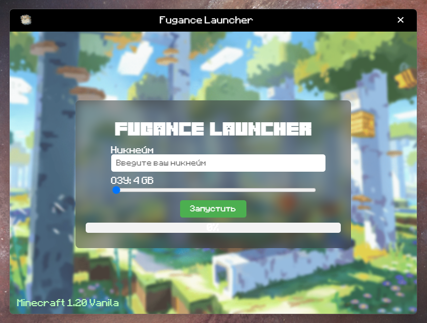
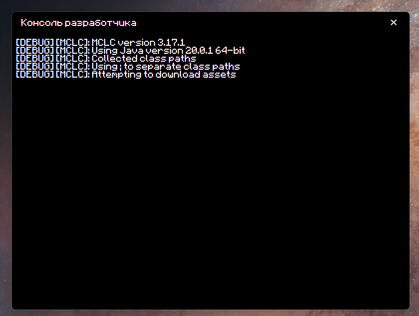

# Fugance Лаунчер 

<a href="https://discord.com/invite/y2QqHMsrwC"></a>


> Лаунчер для сервера Fugance.xyz. Ждём второй сезон.

## Установка
Перед всем установи Node JS и Electron. Все инструкции найдёшь в интернете. 

Используй команду для установки всех нужных библиотек
```bash
cd: [Путь к проекту]
```
В корне основного проекта введите:
```bash
npm install
```
После подождите некоторое время и наберите команду:

```bash
npm start
```

## Сборка проекта

Настройте ```package.json``` к сборке.

```json
{
  "name": "fugance-launcher",
  "version": "0.1.0",
  "description": "Custom Minecraft Launcher",
  "main": "main.js",
  "scripts": {
    "start": "electron .",
    "pack": "electron-builder --dir",
    "dist": "electron-builder"
  },
  "keywords": [
    "minecraft",
    "launcher"
  ],
  "author": "autor",
  "license": "MIT",
  "dependencies": {
    "minecraft-launcher-core": "^3.17.1"
  },
  "devDependencies": {
    "electron": "latest",
    "electron-builder": "^22.14.5"
  },
  "build": {
    "appId": "com.fugance.launcher",
    "asar": true,
    "nsis": {
      "oneClick": false,
      "allowToChangeInstallationDirectory": true,
      "license": "LICENSE.rtf"
    },
    "win": {
      "icon": "icons/app.ico",
      "target": [
        "nsis"
      ]
    }
  }
}

```
Тут настраивается установщик и сам корень сборки. 
```json 
  "build": {
    "appId": "com.fugance.launcher",
    "asar": true,
    "nsis": {
      "oneClick": false,
      "allowToChangeInstallationDirectory": true,
      "license": "LICENSE.rtf"
    },
```
```json "asar": true ``` - эта строка отвечает за возможность сжатия исходников проекта в один файл при сборке релиза.

Дальше можно увидеть:

```json
    "nsis": {
      "oneClick": false,
      "allowToChangeInstallationDirectory": true,
      "license": "LICENSE.rtf"
    }
```
Данный блок отвечает за настройку ```nsis``` - это главный установщик, при сборке проекта, проект автоматическим образом собирается в установщик.

## Вид лаунчера

Тут можно увидеть главное окно лаунчера. На момент версии 0.1.0 прогресс-бар находится в разработке и на данный момент не работает.



На этом фото можно увидеть консоль лаунчера. Консоль выводит основной лог. Но на момент версии 0.1.0 консоль не может транслировать лог java и выводить логи самой игры.
В будущем планируется добавить лог Java, а так-же добавить специальный синтаксис.



## Благодарности

Благодарим https://fonts-online.ru/ за предоставленый шрифт.
Все шрифты защищены авторским правом и не являются продуктом Fugance.xyz

Copyright © 2004-2012, BOGDAN Software

## Помощь

<div align="center">
	<a href="https://vshymanskyy.github.io/StandWithUkraine">
		
	</a>
	<br>
	<br>
	<br>
	<br>
	<br>
	<br>
	<br>
	<br>
	<br>
	<br>
	<div>
